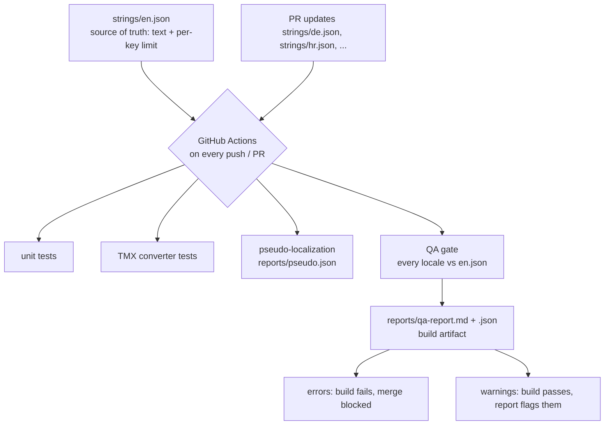

**Continuous localization QA: string tables gated by automated checks in CI**

Continuous localization QA. Game string tables live in the repo; every push and pull request runs an automated QA gate that blocks merges when a translation would break the build or the layout.

This repo connects my standalone tools into one workflow. The tools catch problems; the pipeline makes catching them automatic.

---

## The problem

String QA usually happens once, right before delivery. Then someone edits one string, nobody re-checks it, and a dropped `{0}` ships to production. Manual QA doesn't scale to continuous content updates and live-ops cadence.

The fix is treating translated strings like code: they enter through pull requests and pass a gate before merge.

---

## Flow



The workflow itself is 40 lines: [.github/workflows/qa.yml](.github/workflows/qa.yml).

---

## What the gate checks

Per string, per locale, using the same rules as [LQA Checker](https://github.com/zirafinjezik/lqa_checker):

| Check | Severity | Example |
|---|---|---|
| Placeholder/tag parity | Error | `{0}`, `%1$s`, `<b>` present in one side only |
| Character limit | Error | Target exceeds the key's `limit` (counted in code points) |
| Coverage | Error | Key exists in `en.json` but not in the target table |
| Stale keys | Warning | Key exists in a target but not in the source |
| Punctuation | Warning | Ending punctuation, `!`, `?`, ellipsis count mismatches |
| Whitespace | Warning | Leading/trailing whitespace, double spaces introduced by target |
| Numbers | Warning | Digits in source missing from target |

Errors fail the build. Warnings pass but land in the report, because a punctuation mismatch is a review item, not a release blocker.

## A failing run looks like this

```
| Locale    | Key        | Severity | Check       | Detail                          |
|-----------|------------|----------|-------------|---------------------------------|
| broken-de | hud.coins  | error    | Placeholder | Missing in target: {0}          |
| broken-de | menu.start | error    | Length      | 29/10 chars, overflow by 19     |
| broken-de | menu.quit  | error    | Coverage    | Key missing in target           |

QA gate failed: 3 error(s).
```

That output comes from `fixtures/`, a deliberately broken locale used by the test suite. `main` stays green. The full generated report is committed at [docs/sample-qa-report.md](docs/sample-qa-report.md).

---

## Pseudo-localization

`npm run pseudo` generates an accented, ~35% longer variant of every source string (`Ĥéļļö` style, wrapped in brackets). Placeholders and tags pass through untouched, so a pseudo build compiles and still clears the placeholder check. Drop it into a build to find truncation and hardcoded strings before any translator touches the file.

```
"hud.coins": "You earned {0} coins!"   ->   "[Ýöü éáŕñéð {0} çöíñš!········]"
```

---

## Components

| Piece | Source |
|---|---|
| Check rules (`tools/checks.js`) | Vendored from [lqa_checker](https://github.com/zirafinjezik/lqa_checker) |
| TMX realignment CLI (`tools/tmx/`) | Vendored from [tmx-language-conversion](https://github.com/zirafinjezik/tmx-language-conversion) |
| Error scoring for human LQA passes | [MQM Error Scorer](https://github.com/zirafinjezik/mqm_checker), outside CI |
| Reviewer training | [LQA Challenge](https://github.com/zirafinjezik/lqa_game) |

The gate automates what a machine can decide. Human LQA still owns meaning, register, and style; the MQM scorer is where those findings get logged and scored.

---

## Run it locally

```bash
npm install
npm test          # 9 unit tests + gate logic
npm run qa        # gate on strings/, writes reports/, exit 1 on errors
npm run pseudo    # writes reports/pseudo.json
python3 -m unittest discover -s tools/tmx
```

Requirements: Node 20+, Python 3.x. No other dependencies.

---

## Notes

- The string tables are demo content (six game UI strings, EN source, DE and HR targets), small on purpose so the pipeline is readable in one sitting.
- Adding a locale = adding one JSON file to `strings/`. The gate picks it up by filename.
- The per-key `limit` field is where UI constraints live. In a real project that data comes from the design system or the engine's string metadata.

---

## Not built yet

Checks I'd add next, in rough order: ICU MessageFormat validation, plural-rule coverage per locale, RTL and bidi-control checks, and screenshot-based UI overflow verification. TMS webhook triggers (run the gate on export instead of on commit) would make this drop into an existing vendor workflow.

## Author

**Natalija Marić**, Žirafin jezik j.d.o.o. Localization engineer and LQA specialist.

- [zirafinjezik.hr](https://zirafinjezik.hr)
- [LinkedIn](https://www.linkedin.com/in/natalija-maric-zirafinjezik)

## License

MIT
